# 🚀 Three-Tier To do App Deployment on AWS EKS with Terraform

This repo walks through standing up a full three-tier To do List application on Amazon EKS, provisioned entirely with Terraform and deployed via Kubernetes. It's meant as a hands-on reference for real-world DevOps workflows — from infra provisioning to container orchestration.


## 📁 Repo Layout

```
3-tier-app-Deployment/
├── backend/              # Node.js API
├── frontend/             # React client
├── mongo/                # MongoDB manifests
├── k8s_manifests/        # Deployment, service & ingress manifests
└── terra-config/         # Terraform infra code
```

## ⚙️ Stack

- **Terraform** — infrastructure as code
- **Amazon EKS** — Kubernetes control plane
- **Amazon ECR** — container image registry
- **Amazon S3** — remote Terraform state
- **Kubernetes** — orchestration
- **Helm** — installs the AWS Load Balancer Controller
- **React / Node.js / MongoDB** — application layer

## 📦 Before You Start

Have these installed and ready to go:

- [ ] AWS account with an IAM user that has `AdministratorAccess`
- [ ] AWS CLI
- [ ] Docker
- [ ] Terraform
- [ ] kubectl
- [ ] eksctl
- [ ] Helm

---

## 🔧 Walkthrough

### Step 1 — Grab the Code

Clone the project locally and move into it:

```bash
git clone https://github.com/workinguser1012/Three-Tier-App-Deployment.git
cd 3-tier-app-Deployment/
```


### Step 2 — Connect Your AWS CLI

Create an IAM user, generate an access key pair, then authenticate locally:

```bash
aws configure
```

Set the region to `us-east-1` and output format to `json` when prompted.


### Step 3 — Spin Up an S3 Bucket for Terraform State

Terraform needs somewhere durable to keep its state file. Create the bucket and lock it down with versioning + encryption:

```bash
aws s3api create-bucket \
  --bucket three-tier-project-2026-storage \
  --region us-east-1 
```

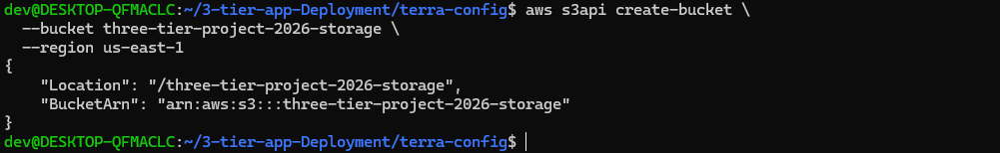


### Step 4 — Provision the Infrastructure

With state storage ready, let Terraform build out the AWS resources:

```bash
cd terra-config/
terraform init
terraform apply --auto-approve
```

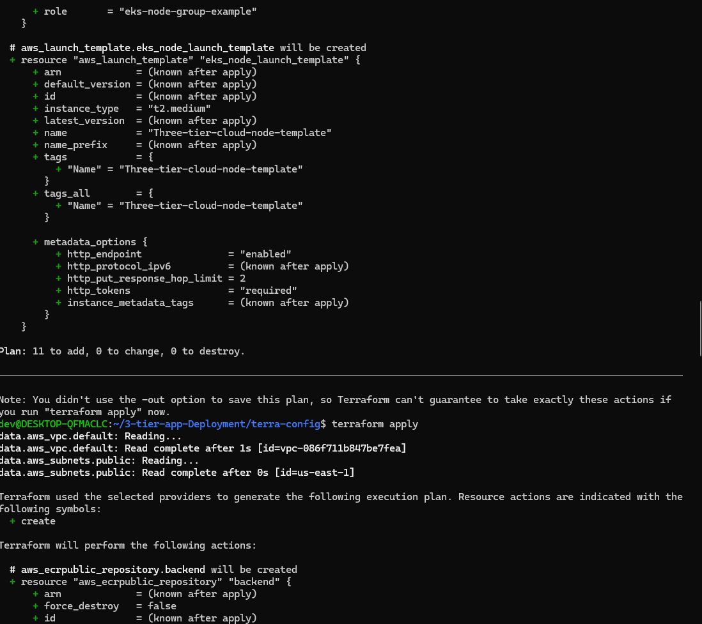


### Step 5 — Push Your Images to ECR

Grab the "View push commands" from the ECR console for both repositories — `three-tier-frontend` and `three-tier-backend` — and run them to build, tag, and push your images.

Then point your manifests at the new image URIs:

- `k8s_manifests/frontend_deployment.yml`
- `k8s_manifests/backend_deployment.yml`

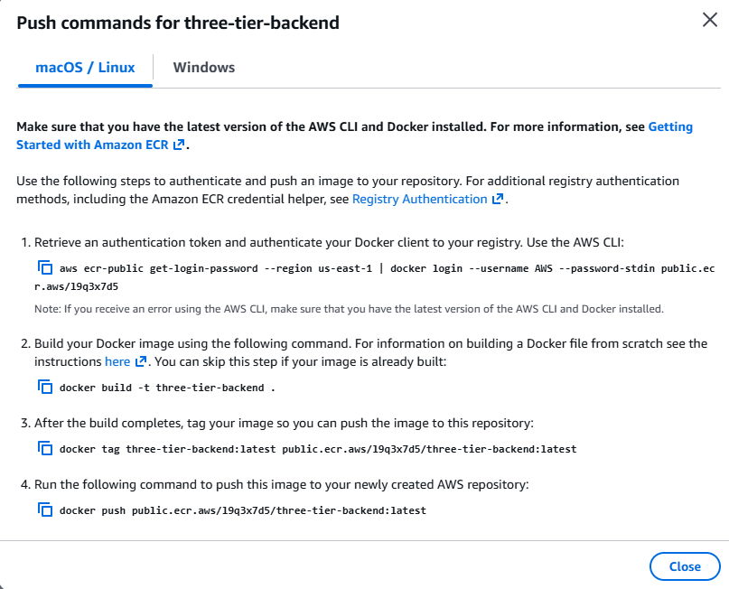

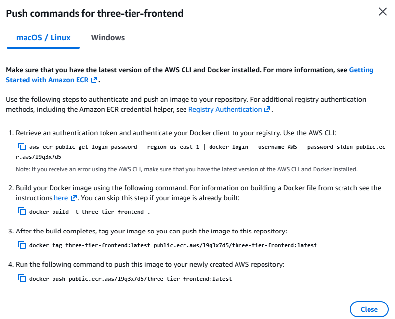

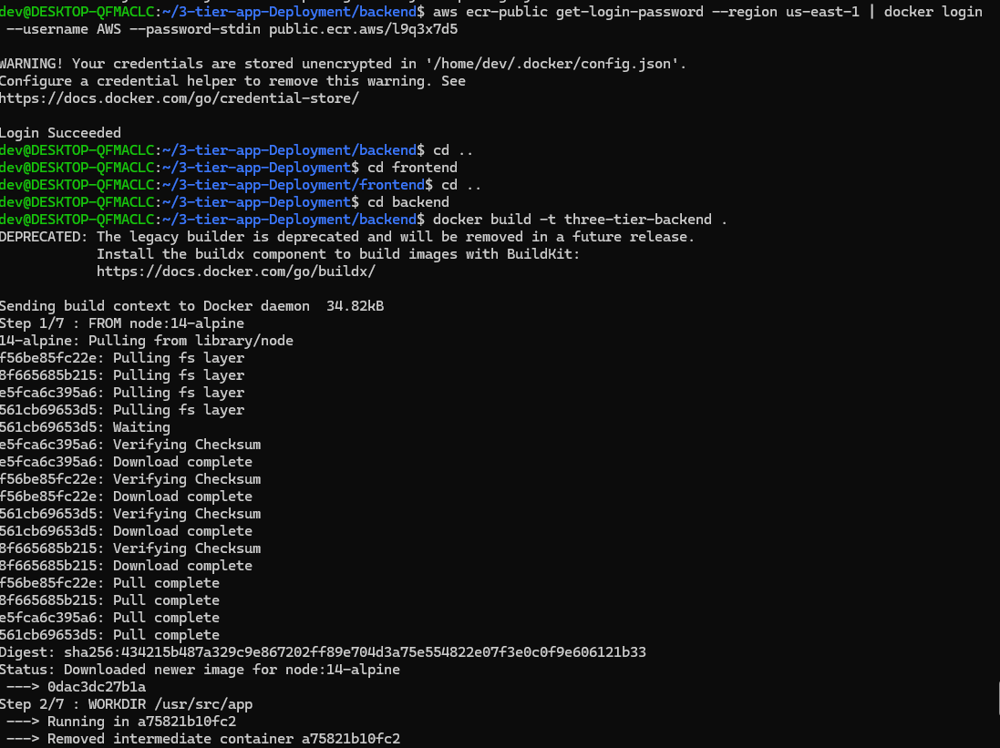

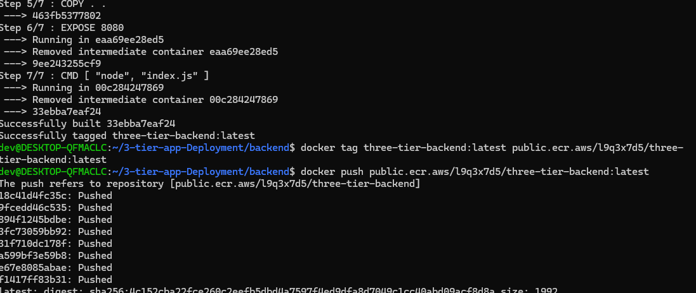

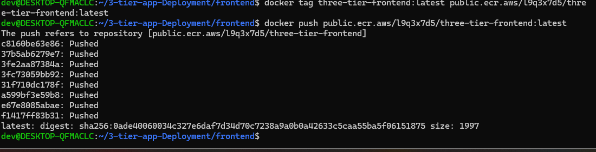


### Step 6 — Deploy the App to EKS

Point kubectl at your new cluster, create a dedicated namespace, and roll out the workloads:

```bash
aws eks update-kubeconfig --region us-east-1 --name Three-tier-cloud
kubectl create namespace workshop
kubectl config set-context --current --namespace workshop

# Deploy frontend and backend
kubectl apply -f k8s_manifests/frontend-deployment.yaml -f k8s_manifests/frontend-service.yaml
kubectl apply -f k8s_manifests/backend-deployment.yaml -f k8s_manifests/backend-service.yaml
kubectl apply -f mongo/
```

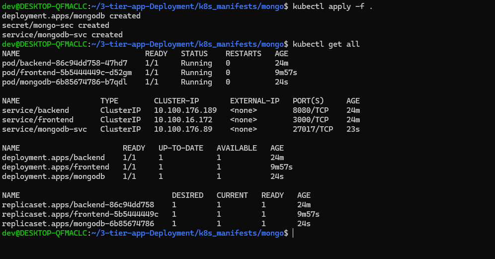


### Step 7 — Wire Up the Load Balancer & Ingress

**a. IAM policy + OIDC provider**

```bash
cd k8s_manifests/
aws iam create-policy --policy-name AWSLoadBalancerControllerIAMPolicy --policy-document file://iam_policy.json

curl --silent --location "https://github.com/weaveworks/eksctl/releases/latest/download/eksctl_$(uname -s)_amd64.tar.gz" | tar xz -C /tmp
sudo mv /tmp/eksctl /usr/local/bin

eksctl utils associate-iam-oidc-provider --region=us-east-1 --cluster=Three-tier-cloud --approve

eksctl create iamserviceaccount \
  --cluster=Three-tier-cloud \
  --namespace=kube-system \
  --name=aws-load-balancer-controller \
  --role-name AmazonEKSLoadBalancerControllerRole \
  --attach-policy-arn=arn:aws:iam::<YOUR-AWS-ACCOUNT-ID>:policy/AWSLoadBalancerControllerIAMPolicy \
  --approve \
  --region=us-east-1
```

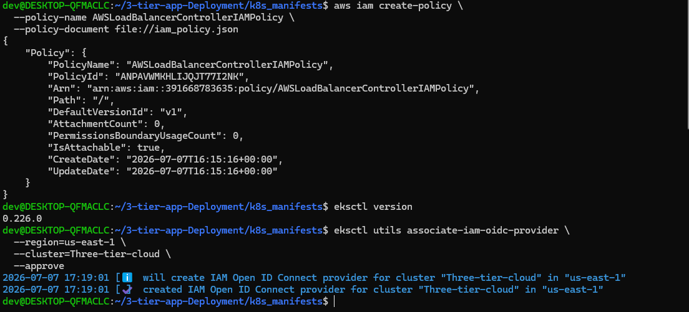

**b. Install Helm and the Load Balancer Controller**

```bash
sudo snap install helm --classic
helm repo add eks https://aws.github.io/eks-charts
helm repo update eks

helm install aws-load-balancer-controller eks/aws-load-balancer-controller \
  -n kube-system \
  --set clusterName=Three-tier-cloud \
  --set serviceAccount.create=false \
  --set serviceAccount.name=aws-load-balancer-controller
```

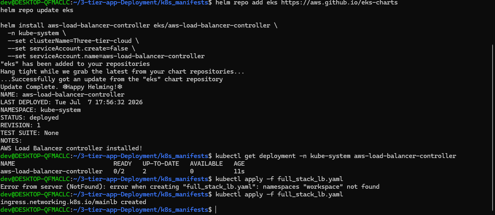

### Step 8 — Apply Ingress and Go Live

```bash
kubectl apply -f k8s_manifests/full_stack_lb.yaml
kubectl get ing -n workshop
```

Grab the `ADDRESS` from the output and open it in your browser — your app should be live! 🎉

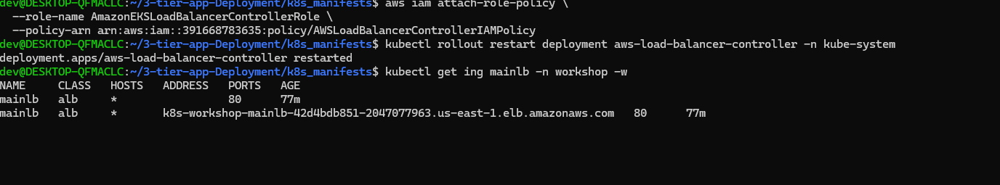

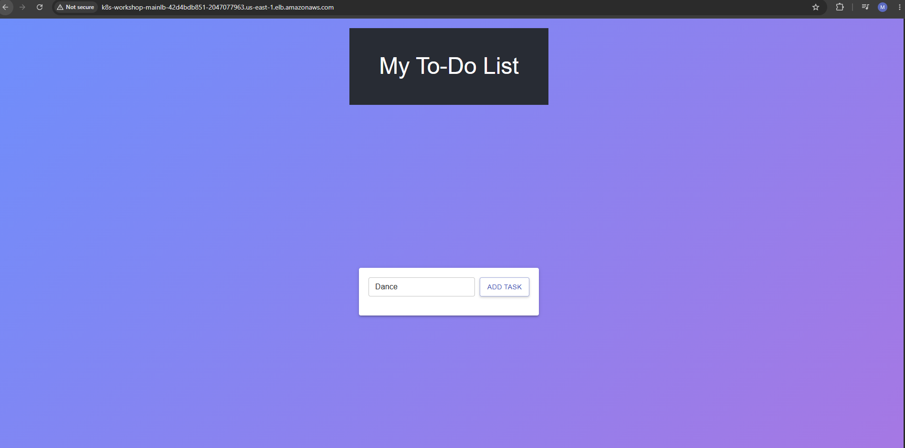


### Step 9 — Automate It with a CI/CD Pipeline (GitHub Actions)

Once the app was up and running manually, the next step was to stop doing all of this by hand. I set up a **GitHub Actions** workflow so that every push to `main` automatically builds fresh Docker images, pushes them to ECR, and rolls out the update to the EKS cluster.

**a. Store your AWS credentials as repo secrets**

In your GitHub repo, go to **Settings → Secrets and variables → Actions** and add:

- `AWS_ACCESS_KEY_ID`
- `AWS_SECRET_ACCESS_KEY`
- `AWS_ACCOUNT_ID `
- `TOKEN`


**b. Add the workflow file**


**c. Push and watch it run**

```bash
git add .
git commit -m "Add CI/CD pipeline"
git push origin main
```

Head over to the **Actions** tab in your repo to watch the pipeline build the images, push them to ECR, and roll the update out to your EKS deployments — no manual `kubectl apply` needed anymore.

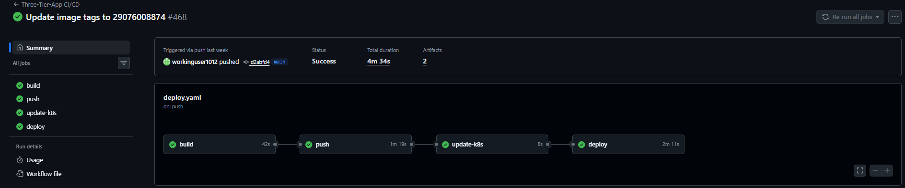

---

## 🧹 Tearing It Down

Once you're done testing, clean up to avoid ongoing AWS charges:

```bash
# Remove ECR images manually via the AWS Console first
terraform destroy --auto-approve
aws s3 rm s3://three-tier-project-2026-storage/eks/terraform.tfstate
# Then empty and delete the bucket via the S3 console
```

---

## ✨ Refrences

**Pravesh Sudha** — (Help with Terraform Infrastrucutre Provison ) ( 3 Tier Application )


